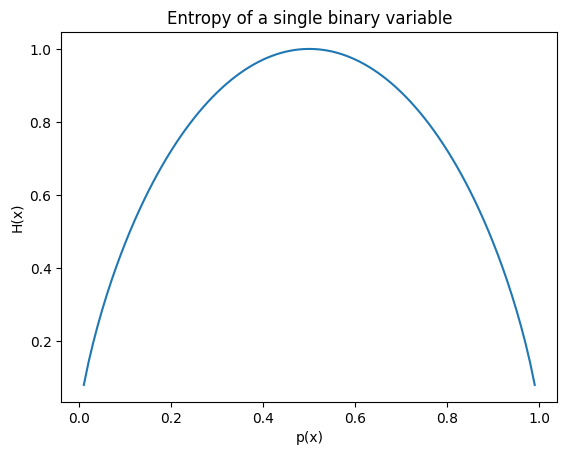
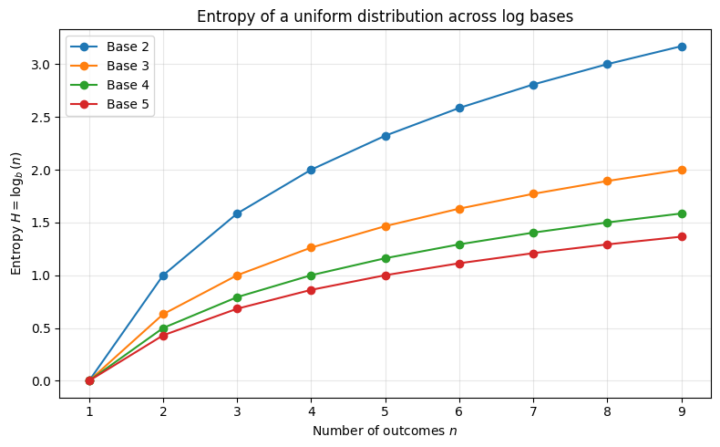

# Entropy

Given a single distribution $P(x)$, the entropy of a distribution, denoted $H(x)$ represents the expected number of "units" we need to encode the information of a variable. 

The formula is 

$H(X) = -\sum_x p(x) \log p(x)$

This can also be written as $H(X) = -\mathbb{E}_x [log(p(x))] $. The "unit" depends on the base used for the logarithm. 
A standard choice is base 2, in which case the entropy will represent the _optimal_ number of bits needed to encode the information. For a single binary variable,
the entropy looks like 

Let's work through an example. 

Suppose you have to report the results of 100 biased coin flips to someone, using a binary encoding. You already know how the coin is weighted, and so agree on the scheme beforehand. 
Starting with the easy examples, we get a fully biased coin, that always return 0 or 1. In these cases, $H(x)=0$. You never have to report anything. 
The other easy case is an unbiased coin flip. In this case, the entropy is 1, meaning you will need 100 bits to send the results. The optimal code 
in this case would be to use one bit per flip, encoding its result.

Suppose a very heavily biased coin towards 0. A reasonable strategy would be to encode every position individually (
7 bits to encode 128 position). If p=0.99, $H=0.08$, then you would need on average 8
bits to encode the results of 100 flips. Sometimes you might not need to send anything (or a predetermined signal to say there was no positive data),
sometimes you need 7 bits, sometimes 14, but the average information with this encoding scheme should be about 7 or 8 (again, it is worth restating that 
the entropy is the theoretical floor that is often only approximated by encoding schemes.) 

Similarly, $p=0.98$ means $H=0.14$, meaning you would need 14 bits for an optimal scheme. The math works out more nicely here, and on average you will need to send 2 positions. 

This scheme breaks down as you get toward higher entropy, but again it illustrates well what entropy means. 

## Proof that entropy is optimal
Let's formalize our earlier example. Note that this proof is not formal but a way to generalize intuition.

Additionally, the proof relies on a specific context, where we are sending chunks of information in a streaming manner. 

To simplify it, suppose we report the results of three coin flips. This means we have eight different wordcode needed to communicate every outcome. 
The streaming aspect is important because it means that each code needs a unique prefix, so that we know exactly where each code ends and begins in a continuous flow of information. 

The proof involves Kraft-McMillan inequality, commonly known as Kraft's inequality, which exactly limit the form this distribution of code words can take. 
The inequality says that for a binary tree (which is taken here to be the codeword, with the edges being labelled in this case), 

$\sum_{l} 2^{-depth(l)}\leq 1 \rightarrow \sum_{c} 2^{-len(c)}\leq 1$

, where l are the leaves or the tree, and c are the codes. The natural interpretation is that if a code is very short (say, 1 bit), it will take half the "mass" available, resulting in much longer codes for all others.

To derive the entropy formulation, we can minimize the expected length $\mathbb{E}_x [len(x)]$ of encoding information subject to Kraft inequality. 

This is solved using Lagrange multipliers. The constraint for optimal code is $\sum_{c} 2^{-len(c)} = 1$. To see that, note that the smallest the sum is, the longer the codes. This forces the tree to be in an "optimal" configuration, with no wasted space. 
The function to minimize is $\mathbb{E}_x [L(x)] = \sum p(x) L(x)$, where L denote the length. 

So we get $\mathcal{L}=f(x)+\lambda g(x) = \sum_i p_i L_i + \lambda \sum_i 2^{-L_i}-\lambda$, where $p_i$ denotes the probability $p(x_i)$. 
Minimizing with respect to both the length $L_i$ of a single code, and to $\lambda$, we get 

$$
\begin{aligned}
\frac{\partial \mathcal{L}}{\partial L_i} &= p_i - \lambda 2^{-L_i}\ln 2
\end{aligned}
$$

and 

$$
\begin{aligned}
\frac{\partial \mathcal{L}}{\partial \lambda} &= p\sum_i 2 ^{-L_i}-1
\end{aligned}
$$

The next step is to solve for $2^L_i$, getting

$$
\begin{aligned}
p_i - \lambda 2^{-L_i}\ln 2 &= 0 \\
\lambda 2^{-L_i}\ln 2 &= p_i \\
2^{-L_i} &= \frac{p_i}{\lambda \ln 2} \\
\end{aligned}
$$

We can plug this into our contraint $g(x)$ to get

$$
\begin{aligned}
\sum_{i} 2^{-L_i} &= 1 \\
\sum_{i} \frac{p_i}{\lambda \ln 2} &= 1 \\
\sum_{i} p_i &= \lambda \ln 2\\
\lambda &= \frac{\sum{p_i}}{\ln 2} \\
\lambda &= \frac{1}{\ln 2} \\
\end{aligned}
$$

From there, we can conclude by substitution that $2^{-L_i} = p_i$, and isolating $L-i$ 
leads to our results $L_i = -\log_2 (p_i)$.

The final step is tu substitute this into $f(x)= \sum p(x) L(x)$ which naturally leads to the form
$\mathbb{E}[-\log_2 p_i]$.

This is the case for binary trees, but Kraft inequality holds for D-ary tree, and the generalization is trivial. 

## Multiple variable and entropy curves

To build more intuition, it might be useful to look at some entropy curved. 

Notice that entropy of a uniform variable with n outcomes encoded in n-ary tree is always 1. This is trivial to see : if you have
two outcome and 1 bit, you can always represent the full array. 

## Entropy of multiple variables
The joint entropy is, very simple 

$$
\begin{aligned}
H(X, Y) &= -\sum_{x, y} p(x, y) \log p(x, y)
\end{aligned}
$$

The conditional entropy H(X|Y) is a useful quantity which unfortunately does not have a clean motivation for why it
is written that way, other than it being instinctively right and useful to have. 

The conditional entropy is derived from reworking the joint entropy as follows

$$
\begin{aligned}
H(X, Y) &= -\sum_{x, y} p(x, y) \log p(x, y) \\
&= -\sum_{x, y} p(x, y) \log p(x|y)p(y) \\
&= -\sum_{x, y} p(x, y) \left[ \log p(x|y)+\log p(y) \right]\\
&= -\sum_{x, y}p(x, y) \log p(y) -\sum_{x, y} p(x, y)  \log p(x|y)\\
&= -\sum_{y}p(y) \log p(y) -\sum_{x, y} p(x, y)  \log p(x|y)\\
&= H(Y) -\sum_{x, y} p(x, y)  \log p(x|y)\\
\end{aligned}
$$

We define that last term as H(X|Y), and it can be rewriten as $\sum_y p(y) H(X|Y=y)$. So the conditional entropy
of $X$ given $Y$ is the weighted average over potential $Y$ values of entropies $H(X|Y=y)$
## Characterestic of entropy

## Differential entropy for continuous case